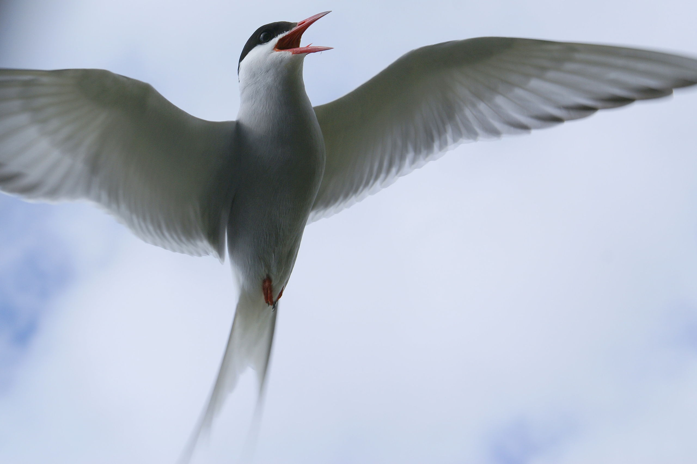

# tern

The [Artic Tern](http://en.wikipedia.org/wiki/Arctic_tern) holds the
long-distance record for bird migration; therein lies the flimsy justification
for the name of this plugin, which handles database migrations.

<figcaption>
  Arctic tern 8664 <a href="http://creativecommons.org/licenses/by-sa/3.0">CC BY-SA 3.0</a>
  by <a href="http://commons.wikimedia.org/wiki/User:OddurBen">OddurBen</a>
</figcaption>

Put `[tern "0.1.0-SNAPSHOT"]` into the `:plugins` vector of your project.clj.
